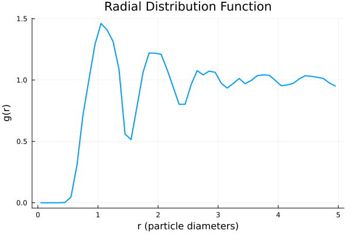

# Analysis of Simulation Results

Simple analyses tasks can be performed using the `SimulationAnalysis` package. See the [documentation](https://github.com/IlianPihlajamaa/SimulationAnalysis.jl) for more details.

To install, use the Julia package manager:
```julia
using Pkg
Pkg.add("https://github.com/IlianPihlajamaa/SimulationAnalysis.jl")
```

We can load the result of a SPV simulation using the `read_SPV_simulation` function from the `SelfPropelledVoronoi` package. This function reads the HDF5 file. 
We can then compute for example the radial distribution function (RDF) of the Voronoi cells using the `find_radial_distribution_function` function from the `SimulationAnalysis` package.


Let's do a simple simulation, and save the results to an HDF5 file:

```julia
import Pkg; Pkg.activate(".")

using SelfPropelledVoronoi, StaticArrays, Random
using Statistics

N = 400
rho = 1.0
L = sqrt(N/rho)
Lx = L
Ly = L
dt = 0.1
pbc_layer_depth = 2.5

# Create a box
box = SimulationBox(Lx, Ly)

# Create a VoronoiCells object
target_perimeters = 3.85*ones(N)
target_areas = ones(N)
K_P = ones(N)
K_A = ones(N)
active_force_strengths = ones(N)*0.01
D_r = ones(N)
voronoi_cells = VoronoiCells(
    target_perimeters,
    target_areas,
    K_P,
    K_A,
    active_force_strengths,
    D_r
)

# Create a ParameterStruct object
kBT = 1.0
frictionconstant = 1.0
random_seed = 564574564
Random.seed!(random_seed)
dump_info = DumpInfo(
    save=false,
    filename="mydata.h5",
    when_to_save_array=0:1000:1000000,
)
rng = Random.MersenneTwister(random_seed)
verbose=true
cb(x...) = nothing 
parameter_struct = ParameterStruct(N = N, dt = dt, 
    kBT = kBT, frictionconstant = frictionconstant, 
    periodic_boundary_layer_depth = pbc_layer_depth, verbose = verbose, box = box, particles= voronoi_cells,
    dump_info = dump_info, callback = cb, RNG = rng)


# Create an ArrayStruct object
arrays = ArrayStruct(N)
arrays.positions .= [rand(SVector{2, Float64}) .* box.box_sizes for _ in 1:N]
arrays.orientations .= 2π*rand(Float64, N) 

# Create an Output object
output = Output()
arrays.neighborlist.check_tessellation = true

# Run the simulation
Nsteps = 10000
run_simulation!(parameter_struct, arrays, output, Nsteps)

dump_info.save = true
Nsteps = 100000
run_simulation!(parameter_struct, arrays, output, Nsteps) 

```

Now we can use this data to compute the RDF:

```julia
using SelfPropelledVoronoi
using SimulationAnalysis

# Load the simulation results
traj, params = SelfPropelledVoronoi.load_trajectory("mydata.h5")
sim = read_SPV_simulation(traj, params)

# Set parameters for g(r) calculation
Nbins = 100
rmax = 5.0

# Calculate the radial distribution function
bin_centres, g_r = SimulationAnalysis.find_radial_distribution_function(sim, Nbins, rmax)

# Plot the g(r)
plot(bin_centres, g_r,
    xlabel="r (particle diameters)",
    ylabel="g(r)",
    title="Radial Distribution Function",
    legend=false,
    lw=2
)
```

